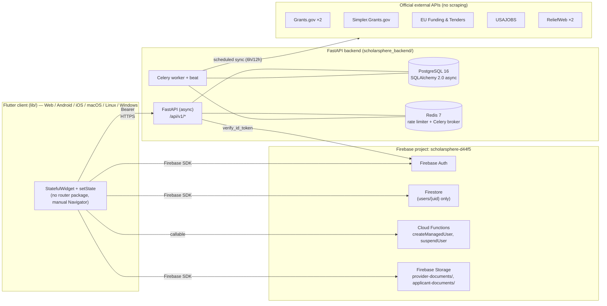
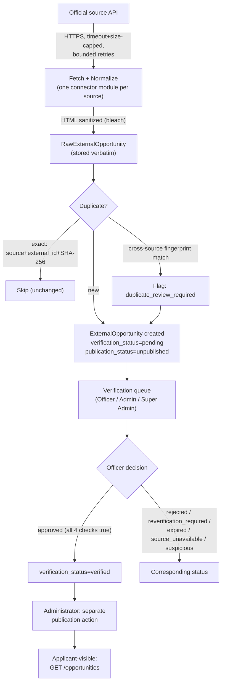

# ScholarSphere — Architecture

**Last verified against the codebase:** 2026-08-21. This document is the
system-design counterpart to `docs/PRODUCTION_SECURITY_AUDIT.md` (a
point-in-time audit, dated 2026-08-17) and `docs/SECURITY_MODEL.md` (the
standing security reference) — read those for security detail; this file
covers structure, data flow, and technical decisions.

---

## 1. Architecture Overview

ScholarSphere is two independently deployable systems sharing one identity
provider:

**Frontend:** Flutter (Dart SDK `^3.12.2`), feature-sliced
`domain/data/presentation`, no state-management or routing package — plain
`StatefulWidget`/`setState` and manual `Navigator` pushes through one
app-level `GlobalKey<NavigatorState>`.

**Identity:** Firebase Auth + Firestore (`users/{uid}` only) + 2 Cloud
Functions. This is the **only** authentication system in the codebase — no
local password hashing or JWT signing exists anywhere.

**Business-data backend:** FastAPI (async) + PostgreSQL (SQLAlchemy 2.0
async, `asyncpg`) + Celery/Redis, in `scholarsphere_backend/`. Auth is fully
delegated to Firebase: the backend verifies the same ID token the client
already has, via `firebase-admin`.

**Data ingestion:** seven official structured APIs across five
organizations (Grants.gov ×2, Simpler.Grants.gov, EU Funding & Tenders,
USAJOBS, ReliefWeb ×2) — see `docs/AUTHORITATIVE_SOURCES.md`. No web
scraping exists in this codebase.

---

## 2. Technology Stack

Only technologies actually present in the dependency manifests are listed.

### Frontend (`pubspec.yaml`)
| Package | Version (resolved) | Purpose |
|---|---|---|
| `flutter` | SDK | UI framework, Material 3 |
| `firebase_core` | 4.12.1 | Firebase bootstrap |
| `firebase_auth` | 6.5.6 | Authentication |
| `cloud_firestore` | 6.7.1 | `users/{uid}` document store |
| `cloud_functions` | 6.3.5 | Callable Cloud Functions client |
| `firebase_storage` | 13.4.5 | Document upload |
| `google_sign_in` | 7.2.0 | Google OAuth |
| `http` | 1.6.0 | Backend HTTP client |
| `file_picker` | 12.0.0 | Document selection |
| `flutter_launcher_icons` (dev) | 0.14.4 | Icon generation |
| `mocktail` (dev) | 1.0.5 | Test mocking |

No router package (go_router/auto_route), no state-management package
(Provider/Riverpod/Bloc/GetX), no animation library beyond Flutter's
built-ins (`AnimatedSwitcher`, `AnimatedSize`, `TweenAnimationBuilder`).

### Backend (`scholarsphere_backend/requirements.txt`)
| Package | Version | Purpose |
|---|---|---|
| FastAPI | 0.141.1 | Web framework (async) |
| Starlette | 1.3.1 | ASGI layer |
| Uvicorn | 0.35.0 | ASGI server |
| SQLAlchemy | 2.0.41 (`[asyncio]`) | ORM |
| asyncpg | 0.31.0 | PostgreSQL async driver |
| Alembic | 1.16.4 | Migrations |
| Pydantic / pydantic-settings | 2.12.5 / 2.15.0 | Validation, config |
| httpx | 0.28.1 | External API HTTP client |
| Celery | 5.5.3 | Background tasks |
| Redis (client) | 6.2.0 | Broker/result backend, rate limiter |
| tenacity | 9.1.2 | Retry/backoff |
| firebase-admin | 7.1.0 | Firebase ID-token verification |
| bleach | 6.4.0 | HTML sanitization |
| pytest / pytest-asyncio (dev) | 9.0.3 / 1.4.0 | Testing |
| respx (dev) | 0.22.0 | httpx mocking |
| aiosqlite (dev) | 0.21.0 | Test-only SQLite driver |
| pip-audit (dev) | 2.10.1 | Dependency vulnerability scan |

Deployed runtime: Python 3.12 (`Dockerfile`).

### Cloud Functions (`functions/`)
Node 20, `firebase-admin ^14.2.0`, `firebase-functions ^7.3.2`.

### Explicitly not present
No AI/LLM integration. No payments integration. No web scraping. No SQL
database other than PostgreSQL (tests use SQLite via `aiosqlite`, dev-only).

---

## 3. Frontend Architecture

**Structure:** every one of the 36 areas under `lib/features/` follows
`domain/` (models, repository interfaces) → `data/` (repository
implementations) → `presentation/` (screens/widgets), though not every
feature has all three (pure client-side logic like `matching/`, `fraud/`,
`search/` has no `data/`).

**The dual demo/api repository pattern** — the single most important
structural fact about this codebase: most features ship **two**
implementations of their repository interface —
`demo_<feature>_repository.dart` (in-memory, resets on restart) and
`api_<feature>_repository.dart` (real HTTP calls to the FastAPI backend).
`lib/app/app.dart`'s `_ScholarSphereAppState` wires up which one production
actually uses, per feature, in its field initializers. This is deliberate:
it let every screen be built and tested against a stable interface before
its real backend existed, and lets tests inject the demo repository without
touching presentation code. See [PRD.md §3](PRD.md) for which features are
currently on which side.

**Routing/navigation:** no router package. `lib/app/app.dart`'s
`_buildHome()` computes what to show:
1. `_initializingAuthentication` → loading spinner.
2. `_user == null` → `AuthScreen`.
3. Authenticated → a role-dispatch chain (`if (user.role == UserRole.X)`),
   see PRD.md §2 for the full role→screen table.

Secondary screens are pushed imperatively via `MaterialPageRoute` through
one `GlobalKey<NavigatorState>`.

**State management:** plain `StatefulWidget`/`setState`. No global state
container.

**API communication:** `Api*Repository` classes wrap `package:http`,
attaching `Authorization: Bearer <Firebase ID token>` and (where relevant)
`X-Correlation-ID`. `ApiOpportunityRepository`'s Firebase Auth access is
lazy (resolved on first request, not at construction) specifically so
constructing it never requires a live Firebase app — this was a deliberate
fix to make widget tests possible without `Firebase.initializeApp()`.

**Authentication flow:** `firebase_auth_repository.dart` handles
sign-in/registration/Google sign-in/password reset/email verification
against Firebase directly; a `demo_auth_repository.dart` in-memory
equivalent exists **for tests only** — production always constructs
`FirebaseAuthRepository()`.

**Background jobs:** `DemoJobQueueRepository` (in-process, not
server-persisted) runs two handlers registered at startup: search-index
rebuild and data cleanup. Fixed 2026-08-21: search-index rebuild now reads
from `_apiOpportunityRepository` (previously read from
`DemoOpportunityRepository`, which meant `POST /search-index/rebuild`'s
own server-side re-validation against real `external_opportunities` rows
rejected every entry, silently leaving the real index empty on every
rebuild). A separate client-side `expiredOpportunityDetection` job was
removed rather than re-pointed at real data: the real backend already runs
this daily and authoritatively via Celery beat
(`detect_expired_opportunities`), and `ApiOpportunityRepository` has no
`replace()`/mutate capability by design (see decision 9 below) — a
client-side duplicate would either need a new backend endpoint purely to
re-implement an existing scheduled task, or do nothing. See PRD.md §3.1
and Changelog.md.

---

## 4. Backend Architecture

**Structure:** `app/api/routes/` (29 route files, one per domain) →
`app/services/` (22 business-logic modules) → `app/models/` (26 SQLAlchemy
model files) with `app/schemas/` (Pydantic request/response DTOs, ~1:1 with
models) as the boundary between them. `app/core/` holds cross-cutting
concerns: `config.py` (settings), `auth.py` (token verification),
`rbac.py` (role/permission dependencies), `errors.py`,
`security_headers.py`, `rate_limit.py`, `http_client.py`.

**Route inventory** (all under `settings.api_v1_prefix = "/api/v1"` unless
noted):

| Router | Domain |
|---|---|
| `external_opportunities.py` | Grants.gov-family import → verify → publish pipeline (largest file, ~900 lines), plus `GET /verification-summary` — real aggregate dashboard counts (added 2026-08-21) |
| `public_opportunities.py` | Public read-only listing (`verified` + `published` only) |
| `providers.py` / `provider_opportunities.py` | Organization registration/verification; provider-submitted opportunities (separate pipeline) |
| `applications.py` | Applicant opportunity tracking |
| `applicant_profiles.py` / `applicant_documents.py` | Private applicant data |
| `notifications.py` | In-app center, preferences, deadline reminders, admin templates |
| `moderation.py` (+ warnings router) | Content moderation |
| `fraud_investigation.py` | Fraud case management |
| `privacy.py` / `legal_compliance.py` | Consent, requests, incidents, policies |
| `source_registry.py` / `taxonomy.py` | Registry/taxonomy management |
| `calendar.py` / `guidance.py` / `experience.py` | Applicant support features |
| `search_index.py` / `recommendation_governance.py` | Search + personalization |
| `provider_analytics.py` / `analytics.py` | Engagement/view analytics |
| `security.py` / `audit.py` | Sessions, login history, alerts, audit trail |
| `system_configuration.py` / `backup.py` / `release.py` / `observability.py` | Operations console |
| `data_lifecycle.py` | Retention, soft/hard delete, legal holds |
| `collection.py` | Manual opportunity intake ledger |
| `support.py` | Support tickets, knowledge base |

**Health:** `GET /health/live` (static), `GET /health/ready` (runs
`SELECT 1`), both unprefixed and exempt from rate limiting.

**Middleware pipeline** (`app/main.py`, in order): CORS → error handling
(correlation ID + request-size guard + uniform JSON error envelope) →
security headers → Redis-backed rate limiting.

**Business logic:** organized as one service module per concern —
notably `parsing.py` (hashing, HTML sanitization, fingerprinting — imported
almost everywhere), `opportunity_import.py` (dedup/conflict pipeline),
`evidence.py`, `deadline_engine.py`, `provider_risk.py`,
`source_scoring.py`, and one source-connector module per external API
(`grants_gov.py`, `simpler_grants.py`, `eu_funding.py`, `usajobs.py`,
`reliefweb.py`, all subclassing an abstract `OpportunitySource` in
`base_source.py`).

**Background processing:** Celery + Redis. Beat schedule
(`app/tasks/opportunity_sync.py`): 7 source-sync tasks every 6/12h, plus
`retry_failed_records`, `detect_expired_opportunities` (daily 01:05 UTC),
`schedule_reverification` (daily 02:15 UTC), `send_reverification_reminders`;
`app/tasks/notifications.py`: `process_due_notifications` (every 5 min),
`retry_failed_notifications` (every 2h).

**Authentication:** `app/core/auth.py`'s `get_current_user` dependency
extracts a Bearer token, verifies it via `firebase-admin`'s
`verify_id_token` (signature + explicit `aud` re-check +
`check_revoked`, forced `True` in production regardless of env var), and
builds an `AuthenticatedUser(uid, email, email_verified, role,
permissions)`. `role` comes from the token's `role` custom claim;
`permissions` are derived server-side from a `ROLE_PERMISSIONS` table (not
trusted from the token) to avoid permission/role claim drift.

**Authorization:** `app/core/rbac.py` — `require_roles(*roles)` and
`require_permissions(*permissions)` dependency factories, used per-route.
`STAFF_ROLES = {verificationOfficer, moderator, supportOfficer,
administrator, securityAdministrator, superAdministrator}`.

---

## 5. External Services

| Service | Used for | Real/Configured |
|---|---|---|
| Firebase Auth | All authentication | ✅ Real |
| Firestore | `users/{uid}` account records only | ✅ Real (default-deny elsewhere) |
| Firebase Storage | `provider-documents/{uid}/*`, `applicant-documents/{uid}/*` | ✅ Real (default-deny elsewhere) |
| Cloud Functions | `createManagedUser`, `suspendUser` | ✅ Real |
| Grants.gov (Search2) ×2 | US federal grants + individual-eligibility scholarships | ✅ Real, no auth required |
| Simpler.Grants.gov | US federal grants | ✅ Real, API key |
| EU Funding & Tenders | EU grants/calls/tenders | ✅ Real, published non-secret API identifier |
| USAJOBS | US federal jobs/internships | ✅ Real, API key; **field mapping not yet smoke-tested against a live response** |
| ReliefWeb ×2 (Jobs, Training) | Global humanitarian jobs/training | ✅ Real, `appname` param |
| PostgreSQL 16 | Primary business-data store | ✅ Real |
| Redis 7 | Celery broker/backend, rate limiter | ✅ Real |

Full detail, base URLs, and rejected-candidate research notes:
`docs/AUTHORITATIVE_SOURCES.md`.

---

## 6. Data Flow

**Opportunity ingestion pipeline** (full detail in
`docs/OPPORTUNITY_VERIFICATION_SYSTEM.md`):

Every arrow that changes state writes a `VerificationHistory` row and an
`ImportAuditLog` entry (actor, action, previous/new value, correlation ID).

**Auth request flow:** Client obtains a Firebase ID token via
`firebase_auth` → attaches it as `Authorization: Bearer <token>` on every
backend call → `get_current_user` verifies it server-side on every request
→ `require_roles`/`require_permissions` gate the specific route.

---

## 7. Security Architecture

Full detail: `docs/SECURITY_MODEL.md` (standing reference) and
`docs/PRODUCTION_SECURITY_AUDIT.md` (dated findings record). Summary:

- **Authentication:** Firebase Auth only — no local password/JWT stack
  exists to secure or get wrong.
- **Authorization:** server-side RBAC on every protected backend route,
  evaluated against the verified token's `role` claim; Firestore/Storage
  default-deny except two explicitly-scoped paths; Cloud Functions
  privilege-gated via `requireAdministrator()`.
- **Data protection:** every mutating write validates through a narrow
  Pydantic schema (never the raw ORM row); all externally-sourced HTML is
  sanitized via `bleach` at both import and edit time; two append-only
  audit tables (`VerificationHistory`, `ImportAuditLog`) record every
  pipeline state change.
- **Environment variables:** `scholarsphere_backend/.env.example` documents
  variable names only; production boot refuses to start if `DATABASE_URL`/
  `REDIS_URL` still hold local-development placeholder values, and forces
  `FIREBASE_CHECK_REVOKED=true` regardless of the env var.
- **Rate limiting:** Redis-backed, fail-open on Redis outage.
- **Known gap:** no endpoint exposes the audit trail or rate-limit events
  for the Security Administrator role to read yet.

---

## 8. Architecture Decisions

Recorded here because they're non-obvious and easy to accidentally violate:

1. **No router package.** Manual `Navigator` + role-dispatch chain was
   chosen over `go_router`/`auto_route`. Any future router adoption is a
   deliberate, cross-cutting migration — don't introduce a second
   navigation pattern alongside it.
2. **Firebase Auth is the only identity system, by design.** The backend
   never issues its own tokens or stores passwords. If PostgreSQL business
   data ever needs a "local user" concept, it should reference the Firebase
   UID as the stable identifier, never dual-write account records
   (`docs/firebase_authentication.md`).
3. **Two separate opportunity pipelines, not one.** `external_opportunities`
   (Grants.gov-family imports) and `provider_opportunities`
   (provider-submitted) are deliberately isolated — different verification
   status sets, different review/history tables, and a provider-submitted
   opportunity does **not** appear in the public Grants.gov-family listing
   even once published (verified by test). They don't share a schema
   because they don't share a review model; don't merge them without a
   product decision.
4. **The demo/api repository pattern is permanent architecture, not a
   migration artifact to delete.** It lets screens exist before a backend
   does, and lets tests run without live infrastructure. Removing a
   `Demo*Repository` should only happen if nothing (test or otherwise)
   still constructs it directly.
5. **Rate limiting fails open, not closed.** A Redis outage was judged
   worse handled as "temporarily unlimited" than as "API fully down" —
   bounded to a 0.5s connect timeout so the failure mode is fast, not a
   hung request.
6. **Verification's checklist is intentionally narrower than the platform
   specification's illustrative 13-item version** (4 items, not 13) — see
   `docs/OPPORTUNITY_VERIFICATION_SYSTEM.md` §4. The richer checklist and
   two-person-approval workflow exist only in the demo repository and were
   deliberately not force-fit onto the real backend's simpler,
   already-enforced model.
7. **Permissions are derived from role server-side, never trusted from a
   token claim.** `app/core/auth.py`'s `ROLE_PERMISSIONS` mirrors
   `lib/features/security/domain/access_control.dart`'s
   `AccessControlPolicy` by hand, specifically to avoid the two drifting
   apart (fixed 2026-08-17, "Harden production secrets and close the
   permission-claims drift gap").
8. **No general-purpose file upload exists.** Only the provider-registration
   document path is real. Building a second upload feature must add its
   own Storage rules scoped the same way (owner-write, size/type capped) —
   never generalize `storage.rules`'s current two paths into a wildcard.
9. **Verification-status transitions are server-authoritative; the client
   never mutates them directly.** `OpportunityRepository`/
   `ApiOpportunityRepository` deliberately expose no `replace()`/mutate
   method — every status change goes through a real backend route
   (`decide_verification`, the scheduled Celery tasks) so it's always
   validated, checklist-gated, and audited. A screen that needs a status
   change must call a real endpoint, never patch a local model and hope a
   background job persists it (fixed 2026-08-21 — see the search-index/
   expired-opportunity background-job note above).

---

## 9. Premium Application-Preparation Platform (2026-09-01)

A paid tier built as a layer on the existing architecture — new tables,
new services, new routes under the existing FastAPI app and SQLAlchemy
session pattern, a new `lib/features/premium/` slice following the
existing demo/api repository pattern — never a parallel stack. See
Database.md §2.14 for the schema and PRD.md §3.1a for feature status.

### 9.1 Payment abstraction

`app/services/payment_provider.py` defines a `PaymentProvider` interface
(`initialize_payment`/`verify_payment`/`get_transaction`/`refund_payment`/
`create_subscription`/`cancel_subscription`/`verify_webhook_signature`/
`parse_webhook_event`) that every route/service depends on — no calling
code imports a specific provider's SDK. Two implementations exist:
`NullPaymentProvider` (the default whenever `PAYMENT_PROVIDER` is unset —
every method raises a clear "not configured" error rather than
fabricating a successful transaction) and `StripePaymentProvider` (a real
integration against Stripe's documented REST API — Payment Intents,
Refunds, Subscriptions, and its published HMAC-SHA256 webhook-signature
algorithm with replay-window protection). A second real provider
(Paystack/Flutterwave, directly relevant given this platform's Sierra
Leone-focused user base) is a new class implementing the same interface
plus one line in `PROVIDER_REGISTRY` — never a change to calling code.

**Idempotency is a database-level guarantee, not an application-level
check.** `payment_events.UNIQUE(provider, provider_event_id)` rejects a
duplicate webhook delivery before any entitlement logic runs;
`entitlements.UNIQUE(source_payment_id)` is a second, independent
backstop even if the first were ever bypassed. `app/services/
payment_service.py::grant_entitlement_for_payment` additionally handles
the resulting `IntegrityError` via `session.begin_nested()`/savepoint
rather than letting a race condition surface as a 500.

**Entitlement is never a boolean flag.** `Entitlement.feature_keys`
snapshots the plan's feature list *at grant time* — a later admin price
or feature-list edit never retroactively changes what an already-paying
user has. `app/core/entitlements.py::require_entitlement` is a
database-backed FastAPI dependency (mirroring `require_roles`/
`require_permissions`'s shape exactly) — entitlements are dynamic (can
expire or be revoked at any time) and must never be cached into a JWT
claim the way role/permission claims are (see Architecture Decision 7
above — the same "never trust a token for something that can change
independently" principle applied to a second domain).

**Two real concurrency bugs were found and fixed building this** (see
Task.md's 2026-09-01 entry for the full diagnosis): raising a route's
`HTTPException` inside `async with session.begin()` silently rolled back
a deliberately-persisted `failed`-status `Payment` row (any unhandled
exception exiting that block rolls back the whole thing — the fix
captures the error and re-raises after the block commits); and
`require_entitlement`'s own database read opened SQLAlchemy's "autobegin"
transaction before the route body's explicit `async with session.begin()`
ran, colliding with it — fixed by closing the dependency's own
transaction immediately after checking the feature, and specifically
*before* that rollback (rollback expires every already-loaded ORM
attribute, unlike commit, so checking after would trigger an illegal
lazy-reload outside the async greenlet context). Both are documented as
general lessons: a FastAPI dependency that reads the database and a route
body that explicitly opens its own transaction can collide, and the fix
belongs in the dependency, checked before any expiring operation.

### 9.2 AI abstraction and the no-fabrication boundary

`app/services/ai_provider.py` mirrors the payment abstraction's shape
exactly: an `AIProvider` interface, `NullAIProvider` default (raises
"not configured" rather than returning placeholder text), and real
`OpenAIProvider`/`AnthropicProvider` adapters. Every network call goes
through the existing shared `app/core/http_client.py` (HTTPS-only,
timeout, bounded retry — Coding_Rules.md §4's "never call httpx directly"
rule applies here too), which gained a small, backward-compatible
`timeout_seconds` override so AI calls can use a longer budget than the
40-second default every other external call shares.

**The no-fabrication rule is enforced by design, not by prompt wording
alone.** `app/services/document_generation.py` splits into two
deliberately different paths: a CV's structured content is assembled
*deterministically* from the applicant's own `ApplicantBackgroundEntry`
rows (no AI involved by default — AI's only role is an explicit opt-in,
narrowly-scoped wording polish that is instructed to add no new fact);
narrative documents (SOP, personal statement, study plan, research
proposal, fellowship essays) do need generated prose, so their prompt is
built entirely from a verbatim "facts block" of the applicant's own real
data plus their own free-text answers, with a system prompt that
explicitly forbids inventing any fact, award, degree, publication,
citation, or statistic. Requirement matching, the readiness score, and
ATS analysis are all deterministic and rule-based specifically so they
work identically — and can never hallucinate — whether or not an AI
provider is configured at all.

### 9.3 Applicant background data — a genuine, pre-existing gap this closes

Before this platform, `ApplicantProfile` only carried summary fields
(`highest_qualification`, `degree_field`, `work_experience_years` as a
bare float) — there was no structured education-history/work-history/
project/publication/award data model anywhere in the codebase. Real,
non-fabricated AI document generation needs one, so
`applicant_background_entries` was added: one table with a `category`
discriminator (education/work_experience/project/publication/award/
leadership_community/skill/reference) and a `details` JSON payload for
category-specific fields, rather than eight near-identical tables — the
same "one flexible JSON payload, read/written as a unit" shape
`ApplicationGuidancePlan.items` already uses elsewhere in this codebase
(Database.md §2.14).
